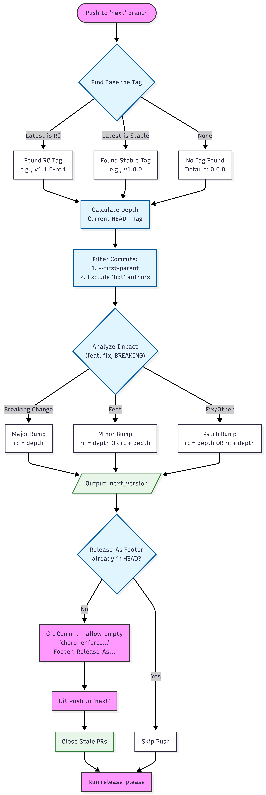

# Smart Release Please

A GitHub Action that intelligently manages semantic versioning for both release candidates (RC) and stable releases. It wraps [googleapis/release-please-action](https://github.com/googleapis/release-please-action) and enforces consistent version calculation based on conventional commits.

## ✨ How It Works

### Next Branch (RC Releases)
1. Finds baseline tag (latest RC or stable tag, defaults to `0.0.0`)
2. Counts real commits since baseline (filters bot commits)
3. Analyzes latest commit impact (breaking, feat, fix)
4. Calculates next RC version
5. Injects `Release-As:` footer if needed
6. Closes stale PRs and runs release-please

### Main/Master Branch (Stable Releases)
1. Finds latest tag and strips RC suffix (`v1.2.3-rc.5` → `1.2.3`)
2. Updates `.release-please-manifest.json`
3. Runs release-please to create stable release

## 🔄 Version Examples

| Baseline | Commit Type | Result |
|----------|-------------|--------|
| `v1.2.3` | `feat:` | `v1.3.0-rc.1` |
| `v1.2.3` | `fix:` | `v1.2.4-rc.1` |
| `v1.2.3` | `feat!:` | `v2.0.0-rc.1` |
| `v1.3.0-rc.2` (+ 1 fix) | `fix:` | `v1.3.0-rc.3` |
| `v1.3.0-rc.2` (+ 3 fixes) | `fix:` | `v1.3.0-rc.5` |

##  Usage

```yaml
name: Smart Release Please

on:
  push:
    branches: [next, main]

permissions:
  contents: write
  pull-requests: write

jobs:
  release-please:
    runs-on: ubuntu-latest
    steps:
      - uses: actions/checkout@v6
        with:
          fetch-depth: 0
          token: ${{ secrets.GH_PAT }}

      - uses: MapColonies/shared-workflows/actions/smart-release-please@smart-release-please-v0.1.0
        with:
          token: ${{ secrets.GH_PAT }}
```

### Required Config Files

- `release-please-config.next.json` - RC releases config
- `release-please-config.main.json` - Stable releases config  
- `.release-please-manifest.json` - Version manifest

## 📝 Conventional Commits

- `feat:` - Bumps minor version
- `fix:` - Bumps patch version
- `feat!:`, `fix!:`, `refactor!:` or `BREAKING CHANGE:` footer - Bumps major version

## 🧪 Testing

```bash
python3 test_rc_align.py  # Run 65 comprehensive tests
```

See `SRP-tests-coverage.md` for detailed coverage.

## 🔗 Related

- [Release Please](https://github.com/googleapis/release-please)
- [Conventional Commits](https://www.conventionalcommits.org/)

## 📐 Architecture

For a visual overview of the workflow logic, see the architecture diagram:

